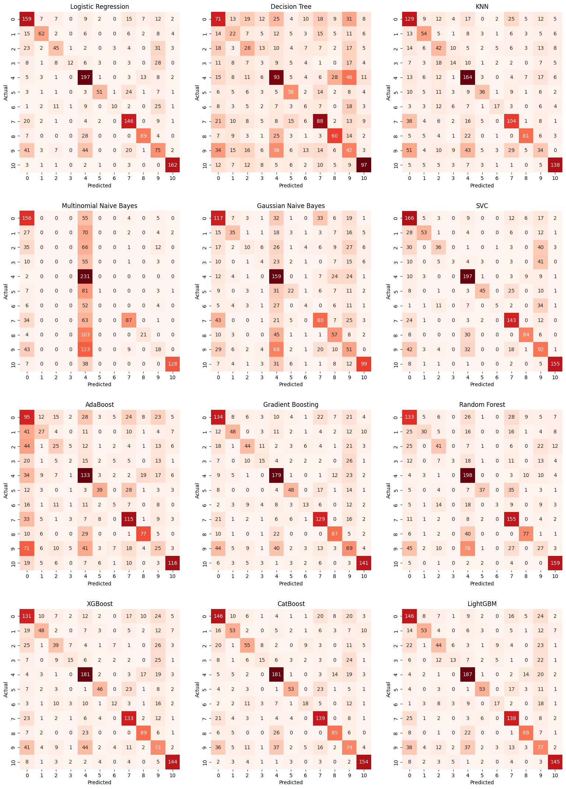
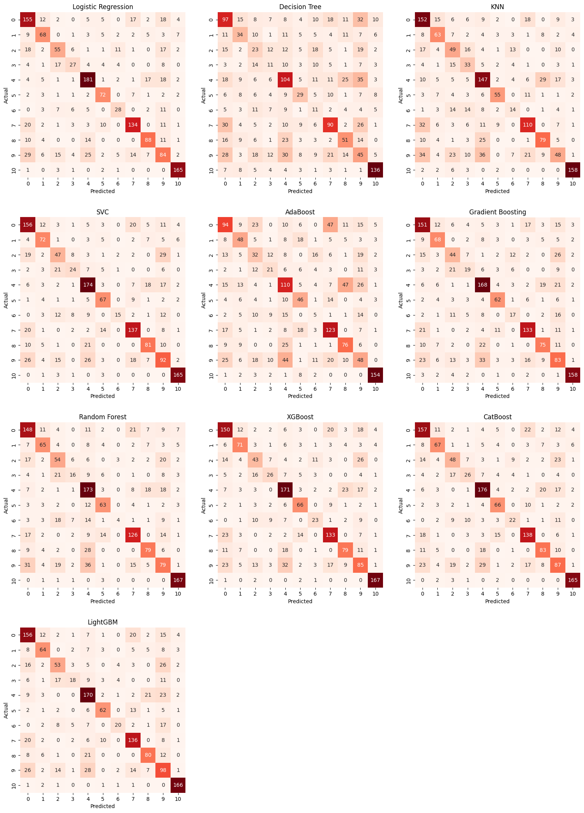
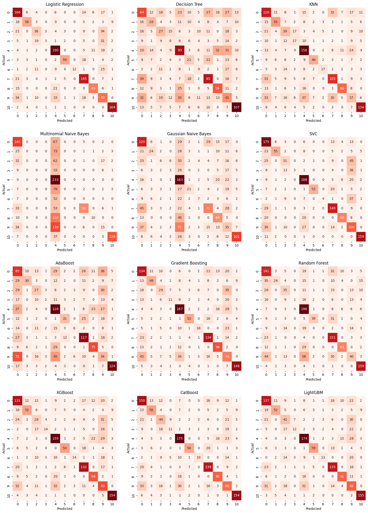
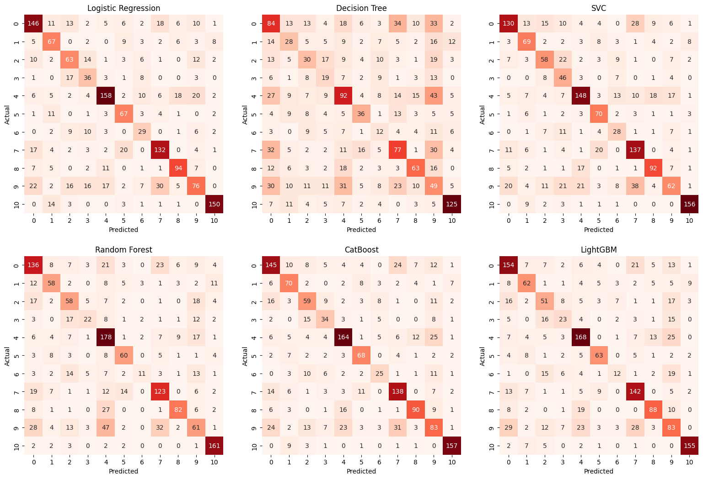

# USING MOVIE PLOT FOR GENRE CLASSIFICATION
## Overview
This project uses summarized plots of movies for classifying their genre. TF-IDF and BERT have been used to generate two different sets of embeddings that have been use in modelling.

## Table of Contents
- Overview
- Table of Contents
- Dataset
- Preprocessing
- Training
- Evaluation
- Dependencies

## Dataset
The dataset used here has been taken from kaggle, you can get it [here](https://www.kaggle.com/datasets/jrobischon/wikipedia-movie-plots). It contained details about ~35,0000 movies including plot summaries, release year, origin, etc.

## Preprocessing

The movie genre column had 2265 unique values, including repetitions, different spellings and other redundancies.<br><br>

All of these were condensed down to 11 major movie genres with enough data for classification purpose. The list for them is given below in order number of observation for each of them:<br>

| Genre | No. of Movies |
|-------|---------------|
| Horror | 1167 |
| Action | 1098 |
| Thriller | 966 |
| Romance | 923 |
| Western | 865 |
| Science Fiction | 639 |
| Crime | 568 |
| Adventure | 526 |
| Musical | 467 |
| Film Noir | 345 |
| Mystery | 310 |
| **TOTAL** | 7874 |

Afterwards the genres are encoded using label encoder and then embeddings are created using __TF-IDF Vectorizer__ and __BERT Base uncased__ model. Afterwards seperate models were built for both set of embeddings.

## Training

We have trained models on TF-IDF and BERT embeddings. At first we trained base line models using both. The `Train_Classifiers()` class used to train models is present in the *helper_functions.py* file.
<br>Then we used class weighting by assigning different classes the following weights:
<br>
| Class | Weight |
|-------|--------|
| 0 | 0.6519291273389634 |
| 1 | 1.3608710680954026 |
| 2 | 1.2602432778489117 |
| 3 | 2.074835309617918 |
| 4 | 0.6133831892186647 |
| 5 | 1.5328012458633444 |
| 6 | 2.309090909090909 |
| 7 | 0.7755343248300994 |
| 8 | 1.1202162469768104 |
| 9 | 0.741012610577828 |
| 10| 0.8275354703100368 |
<br>

The weights have been calculated using the following code:
```
from sklearn.utils import compute_class_weight

weights = compute_class_weight('balanced', classes=np.unique(y), y=y)
weights = {index:value for index,value in enumerate(weights)}
weights
```

The models were again trained and tested and select few were finetuned. 
> Some of the promising models could not be fine-tuned because of their fine-tuning being computationally too expensive.

> *helper_functions.py* was modified in-between so at some places it might show AUC and training times while at others it might not.

## Evaluation

### Initial Modelling

Embeddings are directly used to train and test models to test models to set a quick initial baseline performance. 
<br><br>
Going this way get the following performances with TF-IDF Embeddings:<br><br>

<br>
<br>
The best performances by accuracy are from:<br>
- Logistic Regression: 64%
- SVC: 62.2% 
- CatBoost: 61.8%
- LightGBM: 61%

<br>
Using BERT embeddings the following performance was achieved:<br><br>



<br><br>
The best performances by accuracy are from:<br>
- Logistic Regression: 67.1%
- CatBoost: 65.7%
- SVC: 65.4% 
- LightGBM: 65%

### Using Class weights

Since the number of observations of different classes vary by a wide margin class weights are computed to help models learn better.
<br>
Going this way get the following performances with TF-IDF Embeddings:<br><br>

<br>
<br>
The best performances by accuracy are from:<br>
- Logistic Regression: 64%
- SVC: 62.2% 
- CatBoost: 61.8%
- LightGBM: 61%

<br>
Using BERT embeddings the following performance was achieved:<br><br>



<br><br>
The best performances by accuracy are from:<br>
- CatBoost: 65.58%
- Logistic Regression: 64.6%
- LightGBM: 63.55%
- SVC: 63.2% 

> Using class weights seem to hurt overall performance but since classes are unbalanced we must check other metrics.

### Cross-Validation

As the performance is clearly better with __BERT embeddings__ we will be using them going them forward.
<br>
#### Logistic Regression

Starting with Logistic Regression we use cross validation with Weighted F1 Score as our parameter and get the following results:<br>
| Model | Weighted F1 Score |
|-------|-------------------|
| Unweighted + default parameters | 0.6708896713962726 |
| Weighted + default parameters | 0.6600781535713869 |
| Unweighted + best parameters | 0.6728840114412727 |

The best performance comes from fine-tuned hyperparameters found using `GridSearchCV` with no class weights. The model being the following:
<br>
```LogisticRegression(C=0.3, max_iter=2000, penalty='l2', solver='liblinear')```
<br>
The **cross-validated accuracy** comes out to be `68%`, compared to `67.42%` for the default model.
<br>

#### LightGBM

Now with LightGBM we once again use cross validation with Weighted F1 Score as our parameter and get the following results:<br>
| Model | Weighted F1 Score |
|-------|-------------------|
| Unweighted + default parameters | 0.644975856590887 |
| Weighted + default parameters | 0.6553677280866055 |
| Unweighted + best parameters | 0.660406101978489 |
| Weighted + best parameters | 0.66350711949183 |

The best performance comes from fine-tuned hyperparameters found using `GridSearchCV` with class weights. The model being the following:
<br>
```LGBMClassifier(class_weight=weights, colsample_bytree=0.8, max_depth=7, learning_rate=0.1, n_estimators=300, subsample=0.8)```
<br>
The **cross-validated accuracy** comes out to be `66.9%`, compared to `65.08%` for the default model.
<br>

> The fine-tuning isn't done on SVC and CatBoost due to lack of computation power needed. If you can, please do it 😊

## Dependencies

The dependencies for this project are mentioned in requirements.txt file. The python version used is 3.10.11